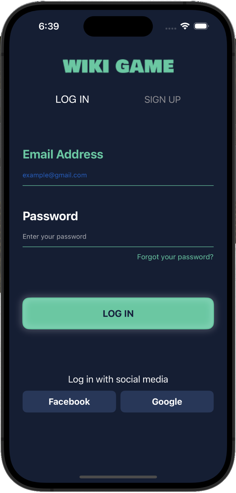
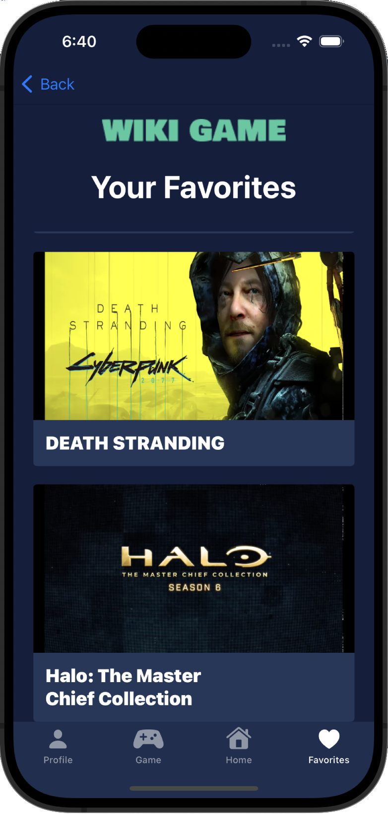
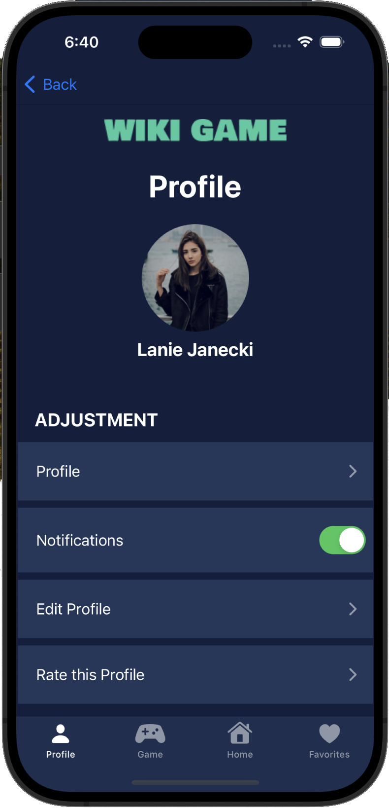
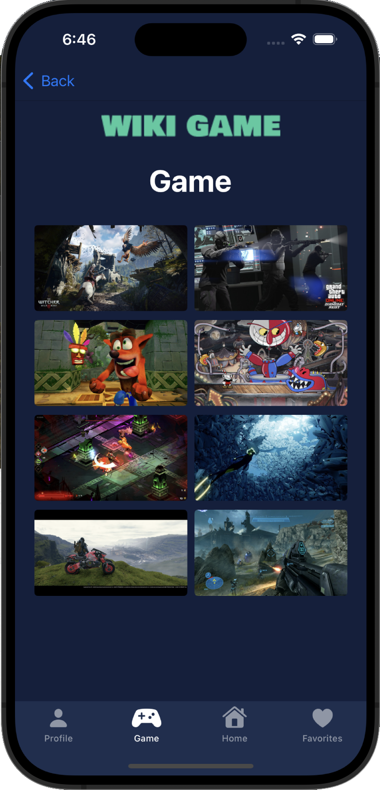
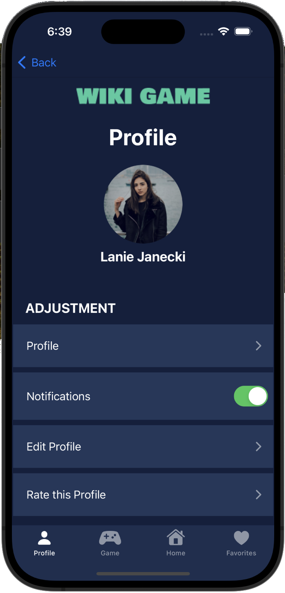

# Wiki Game App

Wiki Game is a SwiftUI application that serves as a comprehensive platform for video game enthusiasts. Users can explore and share game-related video content, read reviews, and participate in community discussions. The app features:

- **Content Discovery**: Find and watch videos related to your favorite games.
- **Community Engagement**: Share opinions and ratings with fellow gamers.
- **User Profiles**: Customize your profile and track your contributions.
  
Explore the repository to see the complete implementation and design details.

